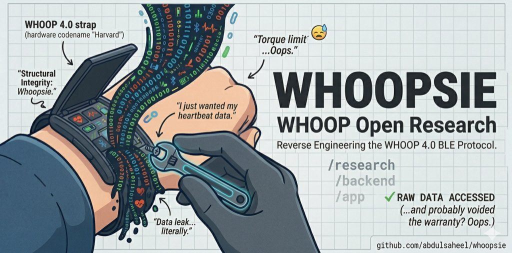

# Whoopsie — WHOOP Open Research

	

> *"You bought it. You own it. Or did you?"*

TL;DR: Whoopsie reverse-engineers WHOOP 4.0 (Harvard), documents the BLE protocol, and provides a minimal companion app + backend to experiment with your own device data.

This repository is the result of one person's curiosity about a device strapped to their own wrist — a device they paid for, that they wear 24 hours a day, and that they have absolutely no insight into beyond what the company chooses to show them on a screen.

---

## What is this?

A reverse-engineering research project, a minimal backend, and a bare-bones Flutter companion app — built entirely by studying the Bluetooth Low Energy protocol that **my own WHOOP 4.0** speaks.

No servers were hacked. No networks were breached. No terms of service of any third-party were violated in a way that affected anyone but myself. A device I own communicated wirelessly — I listened.

---

## Ideology

> *"You can buy a book, but the publisher still controls whether you can read it aloud."*

> *"Ownership used to mean you could open the hood. Now it means you agreed to a license."*

> *"They sold me a heart rate monitor and called it a health platform. I just want my own heartbeat data."*

> *"The most radical act left in consumer technology is understanding what your own device is doing."*

> *"If I cannot study, modify, or understand a device that is physically attached to my body — in what sense do I own it?"*

Modern wearables operate under an uncomfortable paradox: you pay for the hardware, you generate the data, you wear the risk — but the company controls the protocol, the insights, and increasingly, the device's continued function. This research is a small protest against that arrangement.

---

## This project lives across three repositories

- [whoopsie-protocol](https://github.com/project-whoopsie/whoopsie-protocol) ← Start here. The BLE protocol documentation and analysis scripts.
- [whoopsie-backend](https://github.com/project-whoopsie/whoopsie-backend) ← A minimal FastAPI server for ingesting and surfacing WHOOP metrics.
- [whoopsie](https://github.com/project-whoopsie/whoopsie) ← This repo. A Flutter companion app that speaks the native WHOOP BLE protocol.

**Read whoopsie-protocol first.** The app and backend are almost meaningless without understanding the protocol they implement.

---

## Status

This is not a product. This is not beta software. This is not even alpha.

This is one person's research journal, half-implemented and rough at the edges. The app was built primarily to validate that the protocol research was correct. Many things are broken. Many things are hardcoded for a specific device. Many things are placeholders.

WHOOP is not known for its hardware — it is known for its analysis, its algorithms, its coaching intelligence. This repository doesn't come close to replicating that. It doesn't even try. What it does is prove that the raw data stream is accessible, parseable, and meaningful — and that a determined individual with a debugger and patience can understand it.

With enough community support and collaboration, something worthy could eventually be built here. But that is a long road and I have barely taken the first step.

---

## Tested On

- **WHOOP 4.0** (hardware codename: Harvard)
- Android 10+ (tested on a mid-range Snapdragon device)

Other generations (Maverick, Goose, Puffin) may partially work — the protocol documentation covers them, but the code has not been tested against them.

---

## Legal & Ethics

This research was conducted on a device I personally own, using passive Bluetooth observation and analysis of publicly observable wireless communications.

No WHOOP systems, servers, or accounts were accessed, modified, or interfered with. No user data other than my own was captured. No circumvention of encryption was performed — the BLE protocol analyzed here uses no encryption.

This repository is shared for **educational and research purposes only**, consistent with the spirit of security research, right-to-repair advocacy, and personal device autonomy.

**If WHOOP, Inc. believes any part of this repository violates their intellectual property rights, please contact me directly:**

📧 **abdulsaheel81@gmail.com**

I will review any request in good faith and respond promptly. I have no interest in harming WHOOP's business — I just want to understand my own heartbeat.

---

## Contributing

This project is under-resourced and over-ambitious. If you:
- Know more about WHOOP's BLE protocol than what is documented here
- Have a different WHOOP generation and want to test/contribute findings
- Are a Flutter developer who wants to build something real on top of this
- Are a data scientist who wants to build better recovery/strain algorithms

...then open an issue or send a PR. Everything here is a starting point.

---

## Disclaimer

This software is provided as-is, with no warranty of any kind. Use it on your own device at your own risk. Do not use it to access data from anyone else's device. The author is not responsible for any damage to your device, your WHOOP subscription, or your relationship with WHOOP, Inc.
