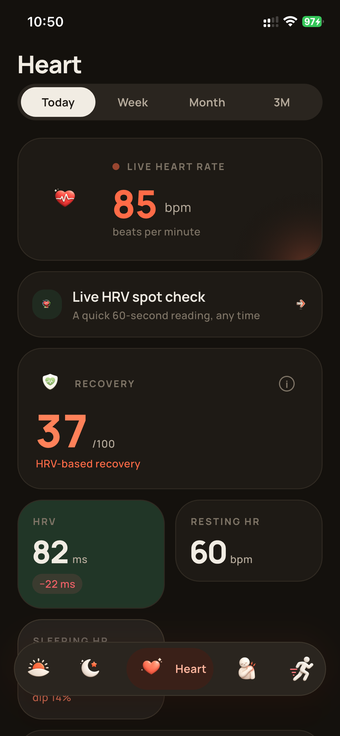
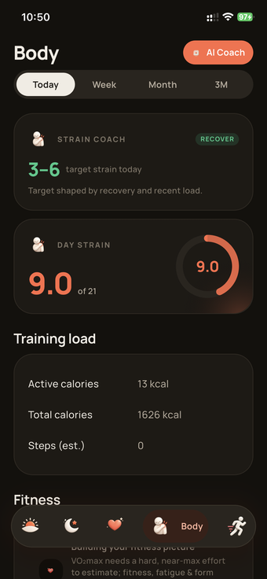
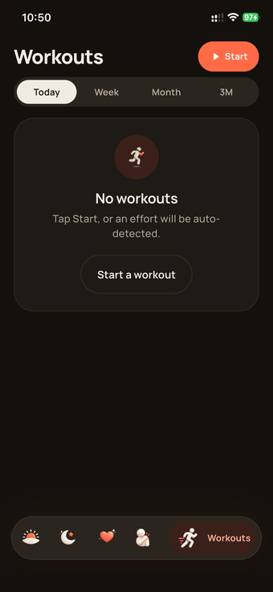
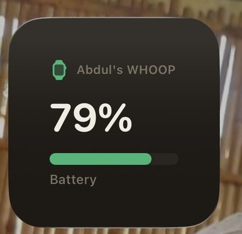

# Openstrap Edge

An app that makes a WHOOP 4.0 useful without a WHOOP subscription. Connects to the band over Bluetooth, computes everything on your phone locally iOS and Android.

> Not affiliated with WHOOP. Not a clone of their app or their scores — see below.


## What made me build this app 

My subscription lapsed and a perfectly good sensor turned into a bracelet. The hardware
never stopped working, only the app that made it useful did. So I reverse-engineered
enough of the band's Bluetooth protocol to talk to it myself, wrote the analytics from
scratch off published research instead of guessing at WHOOP's formulas, and built an app
around the result. Now it works without them, and anyone else stuck with the same
drawer-bracelet problem can use it, or go dig through the code themselves.

## Checklist

- **WHOOP 4.0 only.** Haven't touched a WHOOP 5, don't know if it even shares a protocol.
- Not affiliated with WHOOP, doesn't talk to their servers.
- Not a clone of their algorithms — different math, published methods, cited in the
  analytics repo. Don't expect identical numbers to what their app shows.
- There are bugs. Some I know about, more I probably don't. Open an issue if something
  looks wrong.
- **Don't bounce between this and the official WHOOP app.** A firmware push from their
  app could change the records this one depends on, and there's no fixing that from here.
  Pick one and stay on it.

## Screens

| | | |
|:--:|:--:|:--:|
| <br>**Today** | <br>**Sleep** | <br>**Heart** |
| <br>**Stress** | <br>**Breathing** | <br>**Body** |
| <br>**Steps** | <br>**Workouts** | <br>**Records** |
| <br>**Recap** | <br>**Profile** | |

iOS also gets a home-screen widget, a lock-screen/Dynamic Island Live Activity, and a
couple of Siri shortcuts.

| | | |
|:--:|:--:|:--:|
| <br>**Widget** | <br>**Battery widget** | <br>**Live Activity** |

Every screenshot above is real output from a WHOOP 4.0. 

## What works

**Health** — heart rate, HRV, sleep staging, recovery/readiness, strain, stress, an HRV
spot-check, real-time breathing coherence.

**Activity** — auto-detected workouts, live workout tracking with GPS routes, heart-rate
zones.

**Everything else** — trends/history, a journal with on-device correlation insights
("what actually moves your numbers"), cycle tracking, a deterministic coach, a shareable
weekly recap, a BYOK AI assistant, home-screen widgets, iOS Live Activities, Siri
shortcuts.

## What doesn't work (yet, or maybe ever)

- iOS background sync is best-effort. Apple doesn't give third-party apps a real
  background-service option, so syncing while you haven't opened the app in a while is
  "usually," not "always." 
- Metrics are approximations off published research — not medical-grade, not validated
  against a lab, don't treat any of it as a diagnosis.
- Sideload only right now — not on the App Store or Play Store. You're installing an APK
  or an unsigned IPA straight off Releases. Android's just "allow unknown sources" and
  you're done. iOS needs one extra tool — see
  [`guides/IOS_SIDELOAD.md`](guides/IOS_SIDELOAD.md) if you just want the app and aren't
  planning to build it yourself.

## Run it

```bash
git clone https://github.com/OpenStrap/edge.git
cd edge
cp .env.example .env
flutter pub get
flutter run --dart-define-from-file=.env
```

Quit the official WHOOP app before you pair — Bluetooth only lets one app own the band at
a time. iOS signing and the App Group setup for the widget/Live Activity is its own
longer story — see `guides/IOS_INSTALLATION.md`.

## How it works

```
WHOOP band → Bluetooth → protocol decoder → local storage → analytics → the UI
```

- `openstrap_protocol` turns bytes off the band into records.
- `openstrap_analytics` turns those records into metrics, each with its own confidence
  score attached — nothing gets faked when the data isn't there.
- this repo is the glue: Bluetooth reliability, local storage (versioned, so an algorithm
  update never silently overwrites old results), background sync, the UI.
- everything that matters stays on the phone.

## Complex Bluetooth protocol

The band doesn't have a normal documented API — it's a proprietary protocol, and getting
it to behave reliably took a while. Short version: the clock ships unset (skip setting it
and every timestamp comes out garbage), history comes off in batches that need an exact
8-byte token echoed back or the band just re-sends the same data forever, and the local
save has to happen before that acknowledgement goes out, not after, so a crash mid-sync
can't lose anything.

The full blow-by-blow lives in the [protocol repo's
README](https://github.com/OpenStrap/protocol) — genuinely the more interesting read if
you're into this kind of thing.

## Your data stays on your phone

Everything's computed and stored locally. No cloud account required, no backend this
needs to work day to day. The only network calls this app ever makes are three narrow,
optional things — a one-time legacy-account import if you had an old cloud account, an
OTA/announcement pointer, and a BYOK LLM proxy for the AI assistant. None of them are
required for the app to work.

## Repo layout

```
lib/ble/       Bluetooth + sync
lib/data/      local storage + the repository seam the UI reads from
lib/compute/   runs the analytics pipeline, writes results
lib/state/     AppState, the one source of truth
lib/ui/        every screen
```

Protocol decoding and analytics live in their own repos —
[protocol](https://github.com/OpenStrap/protocol),
[analytics](https://github.com/OpenStrap/analytics).

## Contributing

Found something broken? Open an issue. Found something broken and fixed it? Even better,
send the PR. Protocol-level stuff (new record types, opcodes) belongs in the protocol
repo, metric/formula changes belong in analytics, anything about the app itself —
Bluetooth, storage, UI — belongs here.
