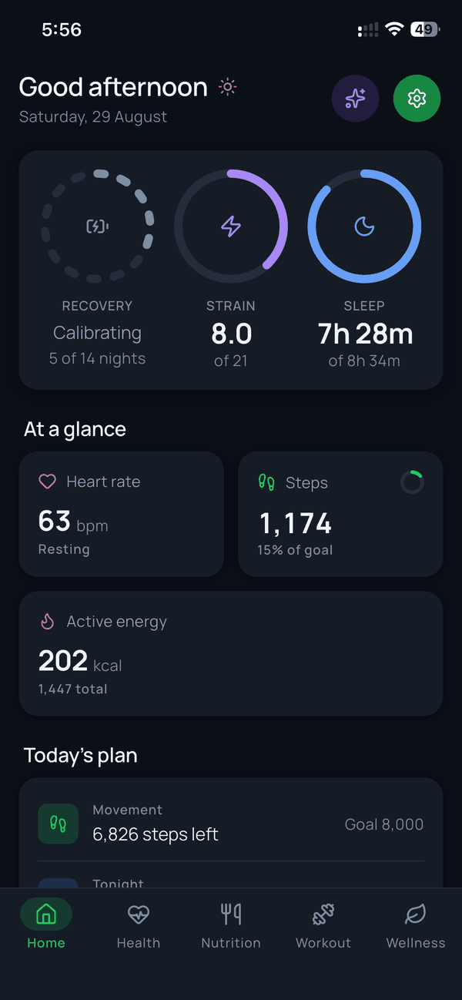
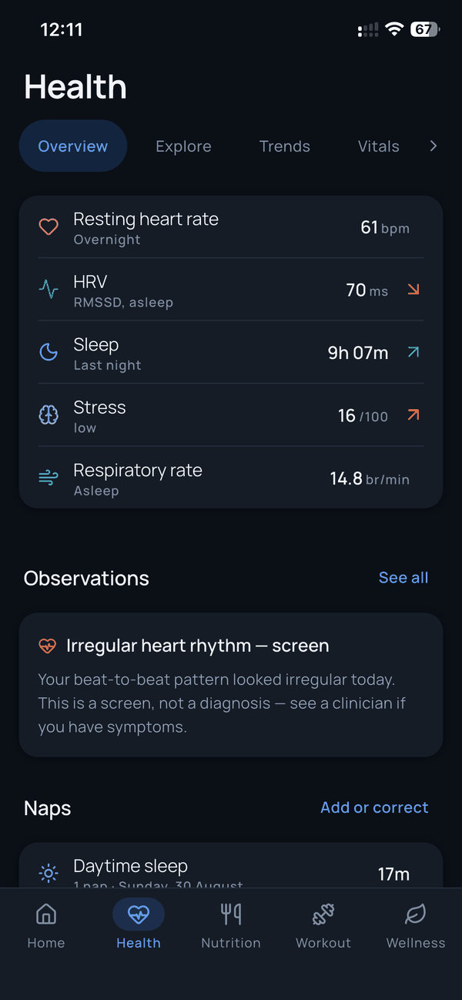
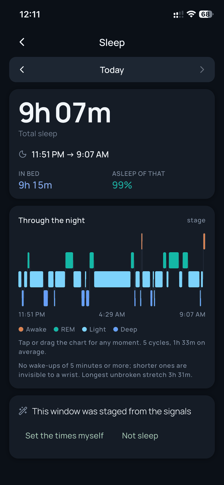
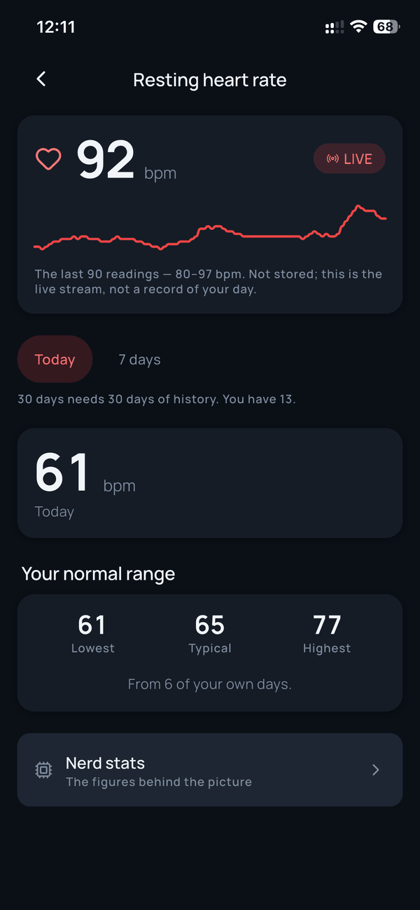
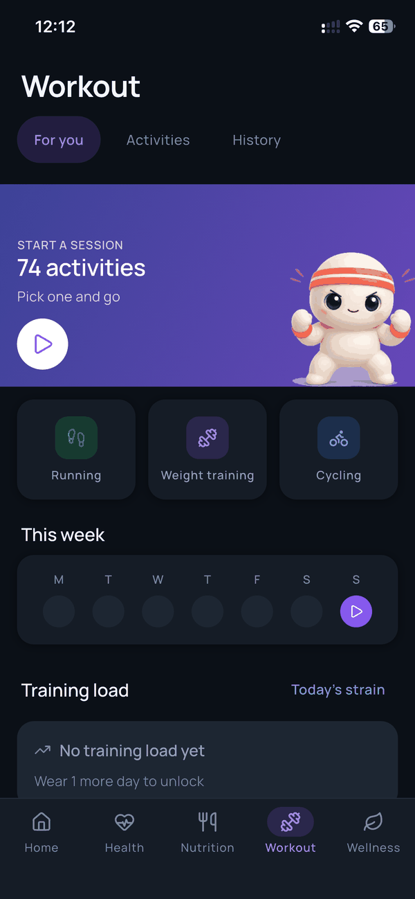

A health app for your wearables. No subscription, no fees, private by default.

<a href="https://trendshift.io/repositories/51733?utm_source=repository-badge&amp;utm_medium=badge&amp;utm_campaign=badge-repository-51733" target="_blank" rel="noopener noreferrer"></a>

[](https://github.com/OpenStrap/edge/releases/latest)
[](https://testflight.apple.com/join/2BVSwq65)

As featured in [Hackaday](https://hackaday.com/2026/07/15/making-a-locked-down-wearable-work-without-a-subscription/) and [Adafruit](https://blog.adafruit.com/2026/07/15/openstrap-edge-makes-a-whoop-4-0-band-useful-without-a-subscription/).

|  |  |  |  |  |
|:--:|:--:|:--:|:--:|:--:|
| Today | Health | Sleep | Heart rate | Workout |

## Devices

**Supported:** WHOOP 4.0, 5.0, MG.

**Being built:** Oura Ring, Garmin, Pebble, Colmi, Ultrahuman, Mi Band and more.

Full feature list: [docs/FEATURES.md](docs/FEATURES.md).

## Support

OpenStrap has no company, no subscription and no paywall behind it. If it's useful to
you, a tip helps keep it going.

**Bitcoin**

```
bc1qvtcch38dcwp967ar764uu6eetw7tf907844wfq
```

**EVM** (Ethereum, Base, Arbitrum, Optimism, Polygon)

```
0x8310C89393366b7eBCD47ABa82e1dfB5ECeFFbD9
```

## Community

[Discord](https://discord.gg/dUXds5MWkd) · [Reddit](https://www.reddit.com/r/OpenStrap/)

## Guides

- [Development: build and run from source](docs/DEVELOPMENT.md)
- [Features](docs/FEATURES.md)
- [iOS installation](guides/IOS_INSTALLATION.md)
- [iOS sideload](guides/IOS_SIDELOAD.md)
- [iOS Shortcuts](guides/IOS_SHORTCUTS.md)
- [Apple Watch setup](guides/WATCH_SETUP.md)
- [AI coach](guides/AI_COACH.md)
- [Tasker integration](guides/TASKER_INTEGRATION.md)
- [Buzz meanings](guides/BUZZ_MEANINGS.md)
- [Writing a device adapter](docs/ADAPTERS.md)

## Contributing

Bug reports from real devices are the most useful thing you can send. PRs are welcome;
read [CONTRIBUTING.md](CONTRIBUTING.md) first, which covers which repo a change belongs
in. Security issues go through
[SECURITY.md](SECURITY.md).

## Privacy

Everything stays on your phone unless you opt in. Details in [PRIVACY.md](PRIVACY.md).

## Disclaimer

OpenStrap is independent and not affiliated with or endorsed by WHOOP, Oura, Garmin or
any device maker. Product names are trademarks of their owners and are used only to
describe compatibility.

## License

AGPL-3.0. See [LICENSE](LICENSE). The OpenStrap name and logo: [TRADEMARKS.md](TRADEMARKS.md).
