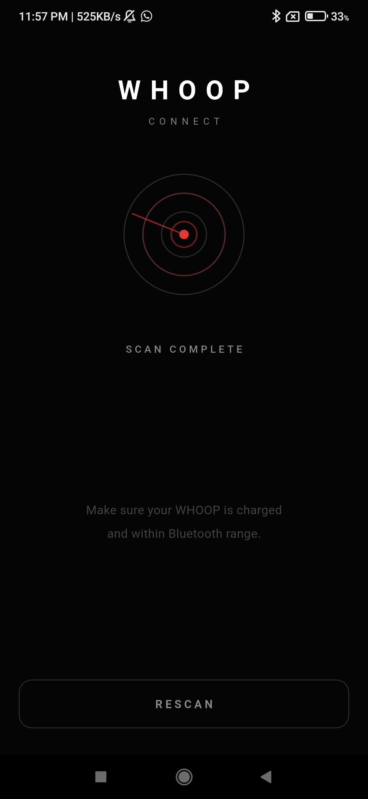
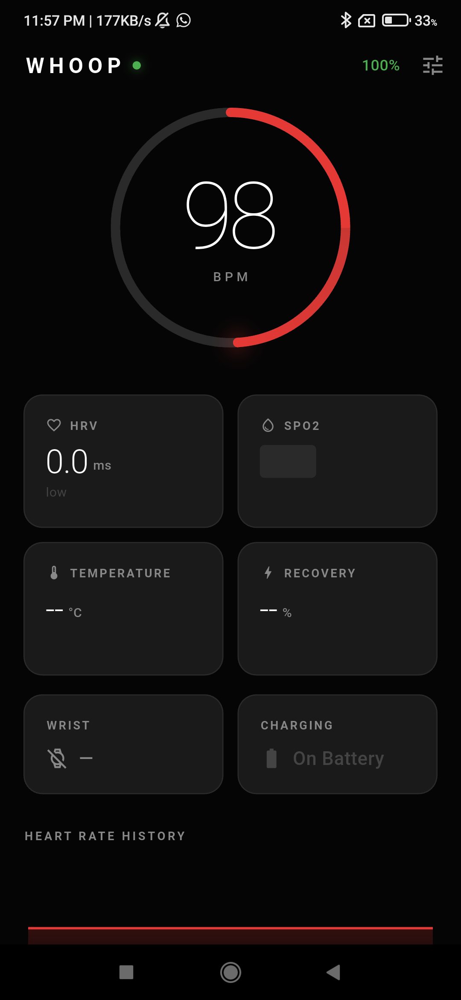
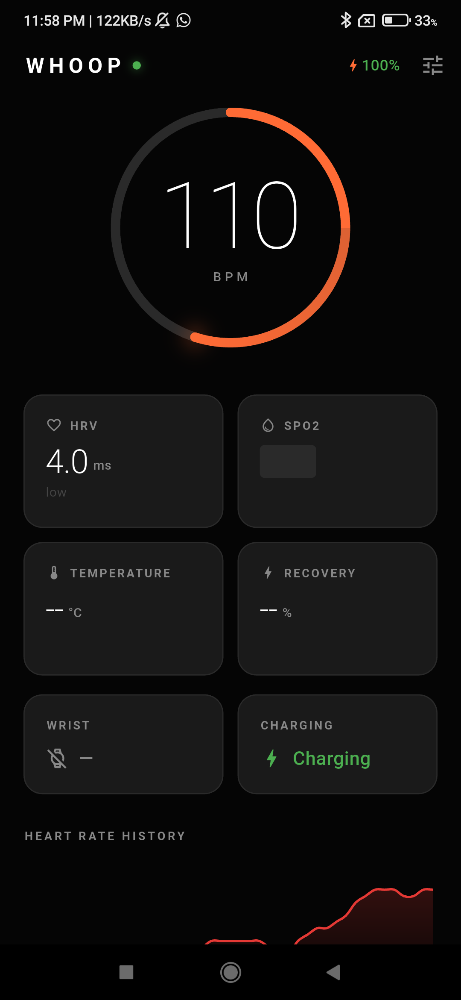
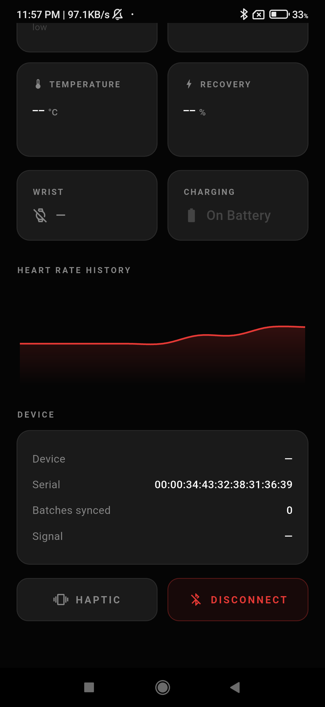
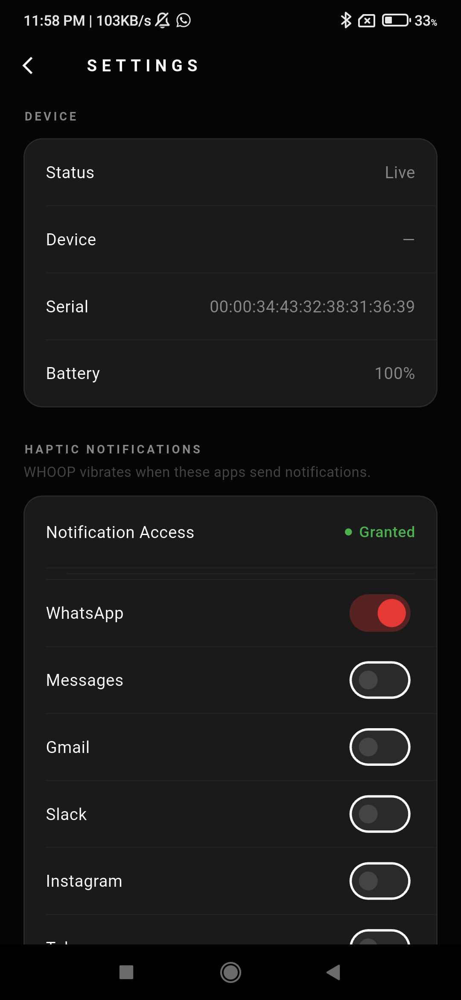
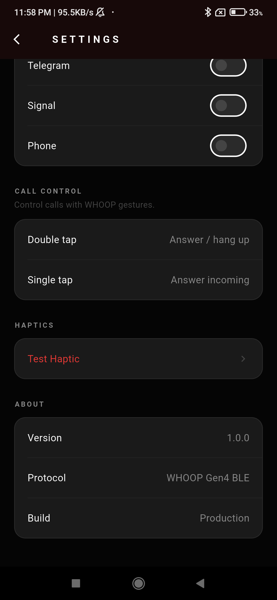

# App

A Flutter companion app that communicates directly with WHOOP 4.0 over Bluetooth Low Energy — bypassing the official WHOOP app entirely.

---

## What This Is (and Isn't)

This app is a **research prototype**. It implements the WHOOP Gen4 BLE protocol (documented in `/research`) well enough to:

- Scan for and connect to a WHOOP device
- Run the initialization handshake
- Sync historical data batches
- Stream realtime HR, IMU (accelerometer + gyro), and PPG optical data
- Send haptic commands to the device
- Route double-tap gestures to Android call control
- Push notifications from selected apps as haptic triggers on the device
- Forward all metrics to the backend for storage and analysis

It does **not** replicate WHOOP's sleep staging, recovery coaching, strain analysis, or any of the intelligence that makes WHOOP worth paying for. The UI is functional but rough. Many values are hardcoded for a specific test device. Many features are placeholders.

> *"Tried and tested on WHOOP 4.0. Your mileage will vary — possibly significantly."*

---

## Before You Build

**Read `/research/WHOOP_BLE_PROTOCOL.md` first.** If you don't understand what a batch ACK is, or why the init sequence has exactly 5 packets, you will not be able to debug anything that goes wrong.

---

## Setup

### Prerequisites
- Flutter 3.19+ with Dart SDK 3.3+
- Android device with BLE support (Android 10+)
- A WHOOP 4.0 device you personally own

### Build

```bash
cd app
flutter pub get
flutter build apk --release
```

### Configure Backend URL

Edit `lib/core/services/api_client.dart`:

```dart
static const _base = 'http://192.168.x.x:5677';  // your backend IP/domain
```

The app will function without a backend — metrics just won't be persisted or analyzed.

---

## Device-Specific Notes

This app was developed and tested against a single WHOOP 4.0 unit. The following things may need adjustment for your device:

- **Battery parsing**: The HelloHarvard packet's battery field uses a raw int32 ÷ 10. If your device reports an obviously wrong value (e.g., always 100%), the raw encoding may differ.

- **BLE MTU**: The app requests MTU 512. Lower negotiated MTU on some Android devices may cause fragmented packet reassembly issues.

- **Service UUID matching**: Three fallback strategies are used to find the WHOOP GATT service. If all fail, connection will report "WHOOP service not found."

- **Double-tap call control**: Uses Android's TelecomManager. Behavior varies by Android version and manufacturer.

- **PPG optical (R21)**: The optical sensor only activates when WHOOP detects skin contact. R21 will not fire when the device is held in hand.

---

## Permissions Required

On first launch, the app requests:
- Bluetooth Scan & Connect
- Location (required by Android for BLE scanning)
- Phone (for call control via double-tap)
- Notifications (for the foreground service notification)

**Notification Access** (for haptic triggers from selected apps) must be granted separately in Android Settings — the app will open that screen directly with a single tap.

---

## Architecture

```
lib/
├── core/
│   ├── ble/           # BLE connection manager, frame reassembler
│   ├── protocol/      # Packet decoders, frame builder, CRC
│   ├── providers/     # Riverpod state providers
│   ├── router/        # go_router navigation
│   └── services/      # API client, local storage, health analytics
├── features/
│   ├── splash/        # Splash screen
│   ├── scan/          # BLE device scanner
│   ├── dashboard/     # Realtime metrics display
│   └── settings/      # Haptic app selection, call control info
└── theme/             # Color palette and theme constants
```

---

## Known Issues / Placeholders

- Battery percentage appears stuck at 100% on the test device
- HRV is rMSSD approximated from R-R intervals derived from HR — not WHOOP's internal method
- SpO2 uses a simplified ratio formula — not medically validated
- No multi-day historical storage from BLE — only in-session data
- No sleep tracking
- Strain is computed server-side, not in-app
- Haptic notification requires manual notification access grant

---

## Screenshots

Below are a few screenshots from the app. Images are stored in the `app/` folder.

<p align="center">
	
</p>

<p align="center">
	
	
	
</p>

<p align="center">
	
	
</p>


## Whoop 4.0 Status

- **Working**
	- [x] Wrist detection (skin contact)
	- [x] Heart rate
	- [x] Battery
	- [x] Haptics

- **Implemented but yet to be tested**
	- [ ] Temperature
	- [ ] PPG (optical)

## Dependencies

| Package | Purpose |
|---------|---------|
| `flutter_blue_plus` | BLE scanning and connection |
| `flutter_riverpod` | State management |
| `go_router` | Navigation |
| `fl_chart` | HR history chart |
| `permission_handler` | Runtime permission requests |
| `shared_preferences` | Persisting last device + haptic app list |
| `http` | Backend API client |
