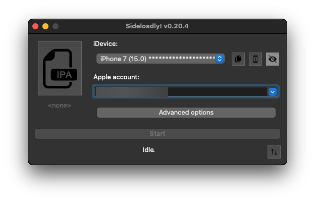
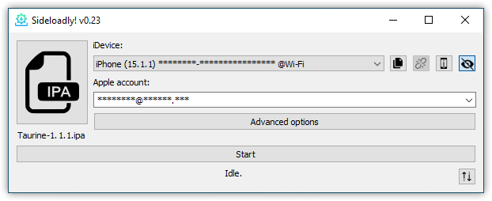
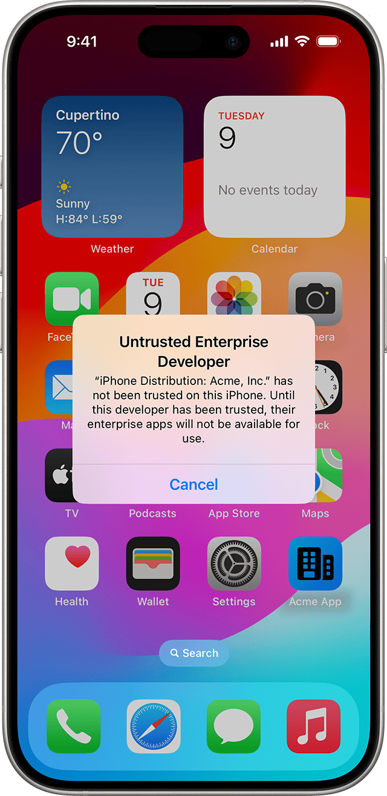
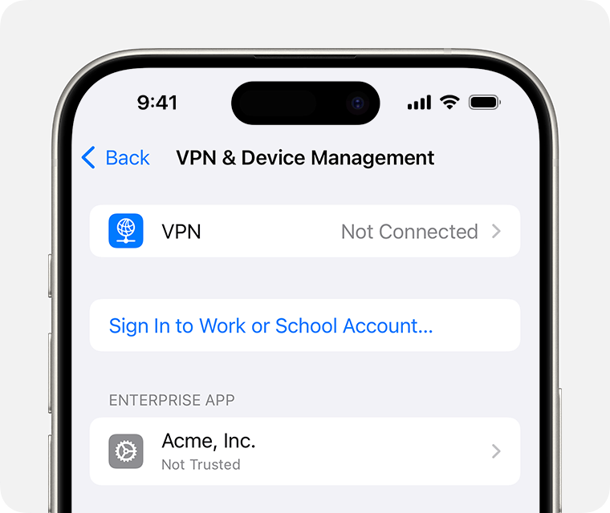

# Installing the iOS build (no Mac, no Xcode)

The iOS file on [Releases](https://github.com/OpenStrap/edge/releases) is an
**unsigned `.ipa`** — it's not on the App Store, so iOS won't just let you tap-install it
like a normal app. You need a small sideloading tool first. This is a one-time setup, and
it's the same process people use for any homebrew/sideloaded iOS app, not something
specific to this project.

If you'd rather build it yourself with your own Apple Developer account and Xcode, see
[`IOS_INSTALLATION.md`](IOS_INSTALLATION.md) instead — that gets you Watch support and
full widget/Live Activity support, which the sideload path below can't always guarantee
(more on that at the bottom).

## What you'll need

- A Windows or Mac computer, just for the install step. Your phone does everything after
  that.
- A USB cable, or Wi-Fi for some tools.
- A free Apple ID (your normal iCloud one is fine).
- The `.ipa` file from [the latest release](https://github.com/OpenStrap/edge/releases).

## Option A — Sideloadly (simplest, works anywhere)

[Sideloadly](https://sideloadly.io) is a free desktop tool, no region restrictions, works
with just an Apple ID.

1. Download Sideloadly for [Windows or
   Mac](https://sideloadly.io/#download) and install it.
2. Plug your iPhone into the computer with a cable, and open Sideloadly.
3. Drag the `.ipa` file you downloaded into the Sideloadly window.

   | macOS | Windows |
   |:--:|:--:|
   |  |  |

4. Enter your Apple ID and password when it asks (this stays between your computer and
   Apple — Sideloadly just uses it to sign the app for your device, the same thing Xcode
   does).
5. Hit start and wait for it to finish installing.

## Option B — AltStore Classic

[AltStore Classic](https://faq.altstore.io/altstore-classic/altserver) is the other
well-known option. It needs a small companion app (AltServer) running on your computer,
and in exchange it can re-sign the app automatically over Wi-Fi every week instead of you
having to reconnect a cable — worth it if you don't want to think about this again for a
while. Install AltServer on your computer, install AltStore on your phone through it, then
open the `.ipa` from AltStore's "My Apps" tab. Their own install walkthrough (linked above)
covers the exact clicks for Windows and Mac.

## Trust the app on your phone

Whichever tool you used, the first time you open the app you'll get a screen saying its
developer isn't trusted yet — that's expected, it's not a sign anything's wrong.

| The warning you'll see | Where to fix it |
|:--:|:--:|
|  |  |

Go to **Settings → General → VPN & Device Management**, find your Apple ID under
"Developer App," tap it, and tap **Trust**. Open the app again and it'll launch normally
from here on.

## Good to know before you start

- **Free Apple ID sideloads expire after 7 days.** iOS will just stop opening the app
  until you re-sign it — reconnect Sideloadly, or let AltServer's Wi-Fi auto-refresh
  handle it. This is an Apple limit on free developer accounts, not something either tool
  can avoid. A paid Apple Developer account ($99/year) makes it last a year instead, if
  you'd rather not deal with weekly refreshes.
- **The home-screen widget and Live Activity might not work.** A free-account resign
  gives the app a different "team ID" than the one the widget's App Group expects to see,
  and there's no way around that from a sideloading tool — it's an Apple-side identity
  check. If those matter to you, building from source with your own signing (see
  `IOS_INSTALLATION.md`) is the only way to get them reliably.
- **The Apple Watch companion app isn't in this build at all.** It's left out on purpose —
  it can't survive being re-signed this way no matter which tool you use, so it's not
  worth shipping broken. Same answer: build from source if you want Watch support.
- None of this touches your WHOOP data or your Apple ID beyond the one-time signing step.
  Sideloadly/AltServer only talk to Apple to get a signing certificate; nothing about your
  band or your health data goes through them.

---
Screenshots: Sideloadly's own site, and Apple's official support documentation.
